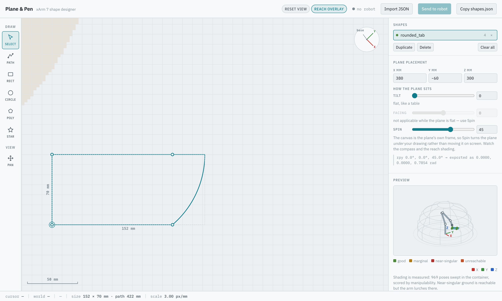

# xArm7 Shape Tracer — Avatar Robotics Code Challenge

ROS 2 (Humble) software that commands a simulated UFactory xArm 7 to trace a list
of 2D shapes in the air, each on its own 3D plane. Built and verified inside the
supplied `avatarrobotics/ros-humble-xarm:20250602` container.

> **No browser or web service is needed to evaluate this.**
> `start.launch.py` loads the included `config/shapes.json` and traces it
> automatically. An optional visual designer lives on the
> [`demo-designer`](https://github.com/dhruvah/avatar-challenge/tree/demo-designer)
> branch; it exports the same JSON this branch consumes.

---

## 1. Run it

Inside the container:

```bash
source /home/dev/xarm_ws/install/setup.bash   # see note below
cd /home/dev/dev_ws
colcon build --packages-select avatar_challenge
source install/setup.bash
ros2 launch avatar_challenge start.launch.py
```

RViz opens with MoveIt and the arm traces the four sample shapes in
`config/shapes.json`: a rotated square, a triangle on a **vertical** plane, an
**arc**-based outline, and a **B-spline** curve traced at 30% speed.

> `~/.bashrc` sources only `dev_ws`. `xarm_moveit_config`, `xarm_planner` and
> `xarm_msgs` live in `xarm_ws`, so it must be sourced first or the launch fails
> with *"package 'xarm_moveit_config' not found"*.

> **Running more than one of these containers at once?** ROS 2 discovery crosses
> container boundaries, so a second container's `move_group` will answer service
> calls meant for the first. Give each its own `ROS_DOMAIN_ID`. This looks
> exactly like a planning bug and is not one.

### RViz displays

| Topic | Shows |
|---|---|
| `shape_tracer/target_shapes` | Intended outlines (green), latched |
| `shape_tracer/actual_path` | Where the tool actually went (orange), one marker per shape |
| `/display_planned_path` | The planned trajectory, animated by the MotionPlanning display |

---

## 2. Define your own shapes

Edit `config/shapes.json`, or point the node at any other file:

```bash
ros2 run avatar_challenge shape_tracer_node.py --ros-args \
  -p shapes_file:=/path/to/my_shapes.json
```

This JSON file is the stable robot-facing interface.

```json
{
  "shapes": [
    {
      "name": "square_45deg",
      "vertices": [[0.0, 0.0], [0.0, 0.100], [0.100, 0.100], [0.100, 0.0]],
      "closed": true,
      "speed": 0.5,
      "start_pose": {
        "position": [0.300, -0.050, 0.250],
        "rpy": [0.0, 0.0, 0.7854]
      }
    }
  ]
}
```

| Field | Meaning |
|---|---|
| `vertices` | 2D points in the shape's own frame. **The first must be `(0, 0)`** — it is what `start_pose.position` pins. |
| `start_pose.position` | `[x, y, z]` in **metres**, in the robot's base frame |
| `start_pose.rpy` | `[roll, pitch, yaw]` in **radians**, REP-103 / tf2 `setRPY` (`Rz·Ry·Rx`) |
| `closed` | *(default `true`)* return to the first vertex to close the outline |
| `speed` | *(default `1.0`)* fraction of planned speed, in `(0, 1]` — see below |

Metres and radians throughout, matching `geometry_msgs/Pose` and the xArm MoveIt
config, so nothing in the pipeline converts units and nothing can forget to.

**`speed` applies to the blended backend only.** It re-times the Cartesian
trajectory after planning; `xarm_planner`'s per-edge services expose no speed
control. With `blend:=false` the node logs a warning naming any shape whose
`speed` it is ignoring, rather than silently obeying half the file.

### Arcs and B-splines

A vertex entry may be a point, an arc, or a B-spline segment:

```jsonc
// arc from the previous vertex to arc_end, about arc_center
{ "arc_center": [0.080, 0.020], "arc_end": [0.100, 0.020], "clockwise": false }

// clamped B-spline; the previous vertex is the implicit first control point
{ "control_points": [[0.040, 0.090], [0.110, 0.070], [0.130, 0.0]], "degree": 3 }
```

Both tessellate into `arc_segments` (default 16) straight sub-segments.

### Parameters

| Parameter | Default | Meaning |
|---|---|---|
| `shapes_file` | — | Path to the shape JSON (required) |
| `lift_height` | `0.03` | Pen-up clearance along the plane normal |
| `arc_segments` | `16` | Tessellation resolution for curves |
| `closed` | `true` | Default for shapes that don't say |
| `blend` | `true` | One continuous trajectory vs. per-edge moves |
| `blend_max_step` | `0.005` | Cartesian interpolation step (m) |
| `home_on_start` | `true` | Move to the ready pose before tracing |
| `service_timeout_sec` | `120.0` | Planner / IK service wait |

---

## 3. Optional: the visual designer

The required evaluation path does not need it. On the
[`demo-designer`](https://github.com/dhruvah/avatar-challenge/tree/demo-designer)
branch there is a browser designer for authoring the same JSON: draw on a
millimetre grid, see the workspace shaded by measured manipulability, press
**Send to robot**, and watch the trace animate live.



```bash
git checkout demo-designer
colcon build --packages-select avatar_challenge && source install/setup.bash

ros2 launch avatar_challenge designer.launch.py    # MoveIt + RViz + the designer
# or, against an already-running stack:
ros2 run avatar_challenge designer_server_node.py
```

Then open <http://localhost:8080>. If the container does not publish port 8080,
`tools/docker_tunnel.py` forwards it over `docker exec` (loopback only).

**Copy shapes.json** in the designer produces exactly the format documented
above — paste it into `config/shapes.json` on either branch and
`start.launch.py` will trace it. Both branches run the same tracing engine and
the same schema; the designer is an authoring layer, not a second
implementation. `start.launch.py` works unchanged on both.

---

## Approach

### From a 2D shape to a 3D path

Each shape's plane is the local XY plane (`z = 0`) of the frame given by
`start_pose`. A vertex `(x, y)` maps to `position + R(rpy) · [x, y, 0]`, so
`(0, 0)` lands exactly on `start_pose.position` by construction.

**Tool orientation is constant across a shape**, equal to the plane frame's
rotation *flipped 180° about X* so the tool points **into** the plane — a pen
against a surface rather than away from it. Not cosmetic: un-flipped, a
horizontal shape is traced with the end-effector pointing straight up, which is
both backwards and measurably less reachable.

### Order of operations

Home to the ready pose → **then** per shape: preflight IK on every waypoint →
approach pen-up above the first vertex → descend → trace → lift.

Homing happens first, before any preflight, so the arm starts from a known
configuration; the reachability check runs before each shape's *own* motion. The
hover waypoints are what stop the tool dragging a line between shapes.

### Two execution backends

**`blend: false`** — each edge is one `xarm_straight_plan` + `xarm_exec_plan`.
The `xarm_planner` node wraps `MoveGroupInterface` behind plain services, which
matters because this container ships **no Python MoveIt bindings** — there is no
supported Python route to `MoveGroupInterface`. Exact corners, but the arm stops
at every vertex.

**`blend: true` (default)** — the whole waypoint list goes to
`/compute_cartesian_path` in one call, producing one continuously
time-parameterised trajectory executed via `/execute_trajectory`. The arm never
stops mid-shape.

Two guards on that path:

- `jump_threshold` is deliberately **disabled**. It spuriously truncates valid
  paths near the 7-DoF wrist's redundant configurations.
- Because of that, completeness is enforced strictly instead: the service's
  error code must be success **and** `fraction` must be 1.0 to within 1e-9. A
  99.5% path is three and a bit sides of a square, so it is refused rather than
  drawn and reported as done.

### Deterministic motion

The free-space approach tries a straight line first and falls back to the
sampling planner only if that cannot be planned; across the sample shapes the
fallback is never needed. This matters because the xArm MoveIt config defaults
to **RRTConnect**, which produced a different meandering approach on every run.
Measured after the change: total joint travel over a full four-shape run was
identical on three consecutive runs.

### Preflight and failure handling

Every waypoint is checked against `/compute_ik` with collision avoidance before
that shape moves; an out-of-workspace shape is rejected naming the exact
coordinates. An IK service that does not *answer* raises a distinct error —
"MoveIt is down" and "that pose is unreachable" need different fixes.

A failed shape stops the run and is logged with the reason; remaining shapes are
not attempted. It deliberately does **not** command a "safe lift" afterwards:
the controller's state is unknown after an abort, and blind motion from an
unknown state is worse than stopping. Recovery is re-running, which begins by
homing.

If an execution goal is accepted and then never completes, the node cancels it
rather than exiting — a dead node does not stop the controller.

### Singularity reporting

`kinematics.py` derives FK, the geometric Jacobian and Yoshikawa manipulability
straight from the URDF in plain numpy. Every trace logs its minimum
manipulability and warns below `0.010`. A pose can have a perfectly good IK
solution and still sit where small tool motions demand large joint speeds.

---

## Verification

| What | Result |
|---|---|
| `kinematics.py` FK vs MoveIt `/compute_fk` | **0.000000 mm** |
| Path deviation from the requested outline | **0.04 mm** mean, 0.73 mm max |
| Vertex accuracy, `blend: false` | **0.01 mm** |
| Vertex accuracy, `blend: true` | **2.20 mm** — blending rounds corners |
| Run-to-run repeatability | identical joint travel across 3 runs |
| Trajectory suite | **240/240** planned, 0 unreachable, 0 failures |

```bash
colcon build --packages-select avatar_challenge
colcon test --packages-select avatar_challenge
colcon test-result --all --verbose      # 3 suites, 127 tests
```

Tests need neither ROS nor a robot — `geometry.py`, `shapes_io.py` and
`kinematics.py` import only numpy and the standard library, which is why the
maths lives there rather than in the node. They cover the rotation conventions,
De Boor evaluation, arc sweep direction across the ±π wraparound, schema
rejection cases, Cartesian completeness, action cancellation, and re-timing.

### What the 240-trajectory sweep showed

6 shape types × 2 sizes × 5 positions × 4 orientations:

- **Plane tilt dominates cost** — 0.76° of joint motion per mm of tool motion on
  a table, 1.30° on a wall.
- **Shape type barely matters** (0.79–0.95), so curves are not the difficulty.
- **60% of trajectories sit within 0.1° of the same maximum joint step**, which
  is the time parameteriser running joints at their velocity limit. The motion
  is already time-optimal; lowering `speed` is what smooths it, not adding
  waypoints.
- Worst manipulability observed was 0.0091, close to the base on a vertical
  plane.

### The challenge PDF's example pose is unreachable

The illustrative square starts at `(0.050, 0, 0.150)` — inside the robot's own
base column, with no IK solution at any tool orientation tested. The sample
shapes keep the PDF's geometry (100 mm square, 45° about Z) at a reachable
`x = 0.300`.

---

## Assumptions and limitations

- "The robot's 3D coordinate space" means the base frame. `world` and
  `link_base` are related by identity in this MoveIt config (checked with
  `tf2_echo`), so both readings coincide.
- Tool orientation is constant per shape; a plane whose normal varies along the
  path is out of scope.
- No collision checking *between* shapes beyond MoveIt's own planning scene.
- The manipulability threshold and the workspace numbers come from a sweep at
  three tilts (0°, 45°, 90°). They characterise the workspace; they do not
  certify an individual pose. The IK preflight does that.
- Measurements were taken in simulation, in this container, on an amd64 image
  under emulation. Timings are indicative; geometric results are not.

---

## Layout

```
avatar_challenge/
  avatar_challenge/
    geometry.py           rotations, plane transform, arc + B-spline tessellation
    shapes_io.py          JSON loading and strict validation
    blended_path.py       Cartesian planning, re-timing, execution
    kinematics.py         FK, Jacobian, manipulability from the URDF
    shape_tracer_node.py  preflight, motion strategy, RViz output
  config/shapes.json      the four sample shapes
  launch/start.launch.py  MoveIt + RViz + xarm_planner + the tracer
  test/                   127 tests, no robot required
tools/
  verify_path.py          records link_eef from TF, measures deviation from target
  trajectory_suite.py     plans a batch of shapes and scores execution quality
  workspace_quality.py    the manipulability sweep behind the numbers above
```

Generated sweep outputs are not committed; re-run the tools to reproduce them.

## Possible next steps

- Corner blending with an explicit geometric fillet and a TOPP-RA pass, so the
  corner radius is specified rather than falling out of the interpolation.
- Sweeping the workspace at finer tilt resolution.
