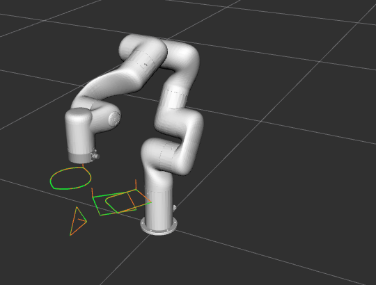

# xArm7 Shape Tracer — Avatar Robotics Code Challenge

ROS 2 Humble software that makes a simulated UFactory xArm 7 trace 2D shapes in
the air, each on its own 3D plane.


## Features

- Straight edges, **circular arcs**, and **clamped B-splines** (De Boor)
- **Continuous Cartesian blending** — one trajectory per shape, no stop at corners
- **Preflight IK** — an unreachable shape is refused before the arm moves
- **Singularity reporting** — every trace logs its minimum manipulability
- **Per-shape speed** scaling; RViz shows target, planned and executed paths
- **Shape Designer**: draw in a browser, press Send, watch it trace

## Setup

```bash
docker run --name xarm-container --platform linux/amd64 \
  -p 5566:3389 -p 127.0.0.1:8080:8080 \
  avatarrobotics/ros-humble-xarm:20250602
```

Connect over RDP to `localhost:5566` (user `dev`), then in a terminal there:

```bash
source /home/dev/xarm_ws/install/setup.bash   # required, or the launch fails
cd /home/dev/dev_ws/src
rm -rf avatar_challenge                       # the image ships a starter package
git clone https://github.com/dhruvah/avatar-challenge.git avatar_challenge
cd /home/dev/dev_ws
colcon build --packages-select avatar_challenge && source install/setup.bash
```

No Dockerfile and no second container — the supplied image already has ROS 2,
MoveIt, the xArm packages and NumPy.

## Run the Shape Designer

```bash
ros2 launch avatar_challenge designer.launch.py bind_address:=0.0.0.0
```

Open **<http://localhost:8080>** in your own browser. Draw a shape, place its plane, press **Send to robot**. The trace animates
over your drawing while the arm moves in RViz. **Copy shapes.json** exports the same
format `start.launch.py` reads. The workspace shading is measured, not guessed —
969 poses swept and scored by manipulability — and only **out of reach** blocks
sending.

`bind_address:=0.0.0.0` lets Docker's published port reach the server; the
host-side `127.0.0.1` binding keeps it off the LAN.

## Run from JSON

`start.launch.py` is the challenge's required launch file — no browser, no port.

```bash
ros2 launch avatar_challenge start.launch.py
```

RViz opens and the arm traces the four samples in `config/shapes.json`: a
rotated square, a triangle on a **vertical** plane, an **arc** outline, and a
**B-spline** at 30% speed.



*Green: target. Orange: where the tool actually went.* Any other file, without
rebuilding: `start.launch.py shapes_file:=/absolute/path.json`.

## Input format

```json
{
  "shapes": [
    {
      "name": "square_45deg",
      "vertices": [[0.0, 0.0], [0.0, 0.100], [0.100, 0.100], [0.100, 0.0]],
      "closed": true,
      "speed": 0.5,
      "start_pose": { "position": [0.300, -0.050, 0.250], "rpy": [0, 0, 0.7854] }
    }
  ]
}
```

Metres and radians throughout. `vertices` are in the shape's own frame and the
first **must** be `(0, 0)` — that is the point `start_pose.position` pins.
`start_pose.rpy` is REP-103 (`Rz·Ry·Rx`), `closed` defaults to true, and `speed`
is a fraction of the planned speed in `(0, 1]`.

A vertex may instead be an arc or a B-spline segment:

```jsonc
{ "arc_center": [0.080, 0.020], "arc_end": [0.100, 0.020], "clockwise": false }
{ "control_points": [[0.040, 0.090], [0.110, 0.070], [0.130, 0.0]], "degree": 3 }
```

## Approach

**2D → 3D.** A shape's plane is the XY plane of the frame given by `start_pose`,
so vertex `(x, y)` maps to `position + R(rpy)·[x, y, 0]`. Tool orientation is
constant per shape and **flipped 180° about X** so the tool points *into* the
plane like a pen — un-flipped it points straight up, measurably less reachable.

**Blending.** The whole outline goes to `/compute_cartesian_path` in one call,
giving one time-parameterised trajectory instead of a stop at every vertex.
`jump_threshold` is disabled — it truncates valid paths near the 7-DoF wrist's
redundant configurations — so completeness is checked strictly instead: success
code *and* `fraction` of 1.0 within 1e-9, since a 99.5% path is three and a bit
sides of a square. `speed` re-times the result (timestamps ×1/s, velocities ×s,
accelerations ×s²), leaving geometry untouched.

**Determinism.** The approach tries a straight line first, falling back to the
sampling planner only if that fails. RRTConnect (the xArm MoveIt default)
wandered differently every run; homing first makes repeated runs identical.

**Safety.** Every waypoint is IK-checked before that shape moves. A failure stops
the run and commands no recovery motion — the controller's state is unknown after
an abort. An accepted goal that never completes is cancelled, not abandoned.

## Verification

| | |
|---|---|
| Path deviation from the requested outline | **0.04 mm** mean, 0.73 mm max |
| Vertex accuracy, per-edge / blended | 0.01 mm / 2.20 mm *(blending rounds corners)* |
| `kinematics.py` FK vs MoveIt `/compute_fk` | 0.000000 mm |
| Repeatability | identical joint travel over 3 runs |
| Trajectory suite | 240/240 planned, 0 failures |

```bash
colcon test --packages-select avatar_challenge
colcon test-result --all --verbose      # 98 tests, 5 suites
```

Tests need no robot: geometry and kinematics properties, plus a regression per
bug found. Figures come from simulation under emulation, so timings are only
indicative; geometry is not affected.

## Limitations

- Tool orientation is constant per shape; a curved surface is out of scope.
- No collision checking *between* shapes beyond MoveIt's planning scene.
- The workspace map characterises reachability; only IK certifies a pose.
- The designer holds one *smooth* flag per shape, so importing a shape built from
  several B-spline runs merges them (it warns when it does).
- The PDF's example pose `(0.050, 0, 0.150)` sits inside the base column and has
  no IK solution, so the samples use `x = 0.300`.
